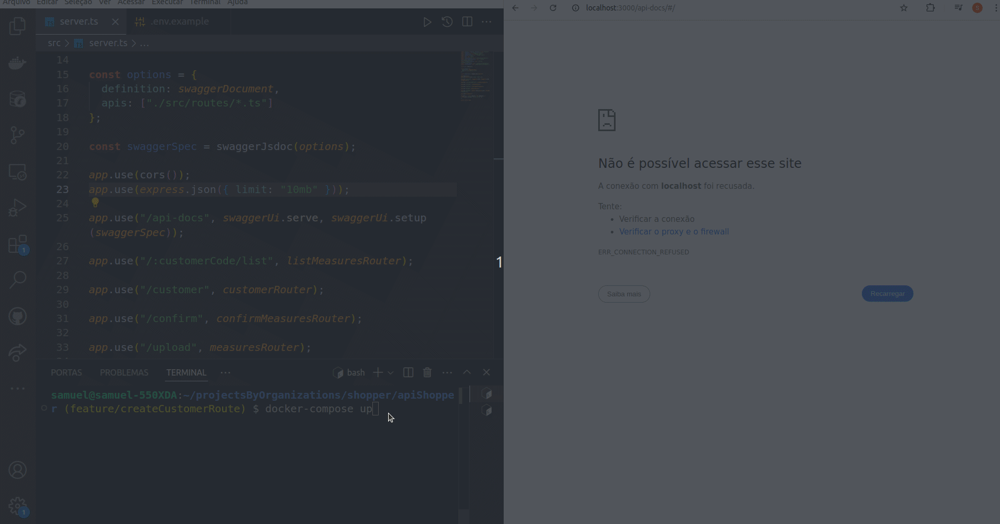
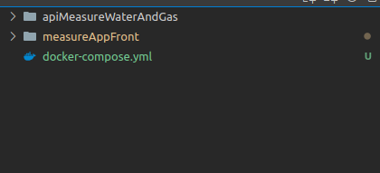

# MeasureApp Frontend

<h2>🌐</h2>
<ul>
  <li><a href="https://github.com/SamuelRocha91/precisionReactApplication/blob/main/README.md" target="_blank">Português</a></li>
  <li><a href="https://github.com/SamuelRocha91/precisionReactApplication/blob/main/README_es.md" target="_blank">Español</a></li>
  <li><a href="https://github.com/SamuelRocha91/precisionReactApplication/blob/main/README_en.md" target="_blank">English</a></li>
  <li><a href="https://github.com/SamuelRocha91/precisionReactApplication/blob/main/README_ru.md" target="_blank">Русский</a></li>
  <li><a href="https://github.com/SamuelRocha91/precisionReactApplication/blob/main/README_ch.md" target="_blank">中文</a></li>
  <li><a href="https://github.com/SamuelRocha91/precisionReactApplication/blob/main/README_ar.md" target="_blank">العربية</a></li>
</ul>




## Descrição

O **MeasureApp Frontend** é uma aplicação web que fornece uma interface amigável para o gerenciamento de medições de consumo de água e gás. Integrada com Inteligência Artificial, permite que os usuários registrem medições, acompanhem o consumo e mantenham um controle detalhado de seus gastos. Esta aplicação faz parte de um sistema completo voltado para a otimização da gestão de recursos de água e gás.

## Funcionalidades

- **Cadastro de Usuários**: Registre novos consumidores na plataforma de forma simples.
- **Medição de Consumo**: Permite a inserção de medições de água e gás diretamente pela interface.
- **Histórico de Consumo**: Exibe o histórico mensal de consumo, com gráficos detalhados.

## Tecnologias Utilizadas

- **React**: Biblioteca JavaScript para criação de interfaces de usuário.
- **Vite**: Ferramenta para desenvolvimento web rápido e eficiente.
- **React Router**: Gerenciamento de rotas para navegação entre páginas.
- **SweetAlert2**: Biblioteca para exibição de alertas interativos e customizáveis.

## Dependências

```json
"dependencies": {
  "react": "^18.3.1",
  "react-dom": "^18.3.1",
  "react-router-dom": "^6.26.1",
  "sweetalert2": "^11.12.4"
},
"devDependencies": {
  "@eslint/js": "^9.9.0",
  "@types/react": "^18.3.3",
  "@types/react-dom": "^18.3.0",
  "@vitejs/plugin-react-swc": "^3.5.0",
  "eslint": "^9.9.0",
  "eslint-plugin-react-hooks": "^5.1.0-rc.0",
  "eslint-plugin-react-refresh": "^0.4.9",
  "globals": "^15.9.0",
  "typescript": "^5.5.3",
  "typescript-eslint": "^8.0.1",
  "vite": "^5.4.1"
}
```

## Como Rodar o Projeto Localmente

### Usando Docker

1. Clone os repositórios:

   ```bash
   git clone git@github.com:SamuelRocha91/precisionReactApplication.git
   git clone git@github.com:SamuelRocha91/apiMeasureWaterAndGas.git
   ```

2. Baixe o arquivo `docker-compose.yml`.

   [Acessar no Google Drive](https://drive.google.com/file/d/1kzs-DJGCvYImBQAqr1GI-zwoNha_b8tA/view?usp=sharing)

3. Coloque o arquivo `docker-compose.yml` na seguinte estrutura de pastas:
   
   

4. Construa as imagens e suba os containers:

   ```bash
   docker-compose up --build
   ```

### Sem Docker

1. Clone o repositório:

   ```bash
   git clone git@github.com:SamuelRocha91/precisionReactApplication.git
   ```

2. Navegue até o diretório do projeto:

   ```bash
   cd precisionReactApplication
   ```

3. Instale as dependências:

   ```bash
   npm install
   ```

4. Inicie o servidor de desenvolvimento:

   ```bash
   npm run dev
   ```

5. Acesse a aplicação no seu navegador através do endereço `http://localhost:5173`.

## Estrutura de Pastas

```bash
precisionReactApplication/
├── assets/          # Imagens e recursos visuais
├── components/      # Componentes React reutilizáveis
├── styles/          # Arquivos de estilo CSS
├── public/          # Arquivos estáticos públicos
├── src/             # Código-fonte da aplicação
└── README.md        # Documentação do projeto
```

## Funcionalidades Futuras

- **Responsividade**: Garantir que a interface se ajuste a diferentes tamanhos de tela.
- **Paginação**: Implementação de paginação em telas de consulta de dados.
- **Melhorias de CSS**: Ajustes de estilo para uma interface mais agradável.
- **Testes Unitários e de Integração**: Garantir a qualidade do código com testes automatizados.

---
