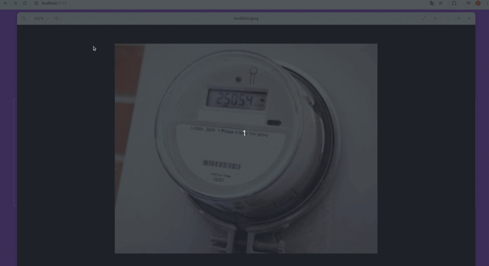

#  تطبيق قياس 

## 🌐 اللغات المتاحة

[](https://github.com/SamuelRocha91/precisionReactApplication/blob/main/README.md) [](https://github.com/SamuelRocha91/precisionReactApplication/blob/main/README_es.md) [](https://github.com/SamuelRocha91/precisionReactApplication/blob/main/README_en.md) [](https://github.com/SamuelRocha91/precisionReactApplication/blob/main/README_ru.md) [](https://github.com/SamuelRocha91/precisionReactApplication/blob/main/README_ch.md) [](https://github.com/SamuelRocha91/precisionReactApplication/blob/main/README_ar.md)




🤖 [مستودع Node الخلفي](https://github.com/SamuelRocha91/apiMeasureWaterAndGas/blob/main/README_ar.md)

<details>
  <summary><h2>نبذة</h2></summary>

**تطبيق قياس** هو تطبيق ويب يوفر واجهة ملائمة لإدارة قراءات استهلاك المياه والغاز. يستخدم الذكاء الاصطناعي، مما يسمح للمستخدمين بتسجيل القراءات، تتبع الاستهلاك والحفاظ على سجل مفصل للتكاليف. هذا التطبيق هو جزء من نظام شامل يهدف إلى تحسين إدارة موارد المياه والغاز.

</details>

<details>
  <summary><h2>الميزات</h2></summary>

- **تسجيل المستخدم**: تسجيل مستخدمين جدد بسهولة.
- **قراءات الاستهلاك**: يسمح بإدخال قراءات المياه والغاز مباشرة من خلال الواجهة.
- **تاريخ الاستهلاك**: عرض تاريخ الاستهلاك الشهري مع تقديم رسوم بيانية تفصيلية.

## التقنيات المستخدمة

- **React**: مكتبة JavaScript لبناء واجهات المستخدم.
- **Vite**: أداة تطوير ويب سريعة وفعالة.
- **React Router**: إدارة التنقل بين الصفحات.
- **SweetAlert2**: مكتبة لعرض تحذيرات تفاعلية وقابلة للتخصيص.

</details>

<details>
  <summary><h2> الاعتماديات</h2></summary>

```json
"dependencies": {
  "react": "^18.3.1",
  "react-dom": "^18.3.1",
  "react-router-dom": "^6.26.1",
  "sweetalert2": "^11.12.4"
},
"devDependencies": {
  "@eslint/js": "^9.9.0",
  "@types/react": "^18.3.3",
  "@types/react-dom": "^18.3.0",
  "@vitejs/plugin-react-swc": "^3.5.0",
  "eslint": "^9.9.0",
  "eslint-plugin-react-hooks": "^5.1.0-rc.0",
  "eslint-plugin-react-refresh": "^0.4.9",
  "globals": "^15.9.0",
  "typescript": "^5.5.3",
  "typescript-eslint": "^8.0.1",
  "vite": "^5.4.1"
}
```
</details>

## كيفية تشغيل المشروع محليًا

<details>
  <summary><h2>🚀 باستخدام Docker</h2></summary>

1. استنساخ المستودع:

   ```bash
   git clone git@github.com:SamuelRocha91/precisionReactApplication.git
   git clone git@github.com:SamuelRocha91/apiMeasureWaterAndGas.git
   ```

2. تحميل ملف `docker-compose.yml`.
   [تحميل من Google Drive](https://drive.google.com/file/d/1p5MKW3YB5En05Jp5ETWxNbmHllinihiH/view?usp=sharing)

3. وضع ملف `docker-compose.yml` في هيكل المجلدات التالي:
   
   

4. بناء الصورة وتشغيل الحاويات:

   ```bash
   docker-compose up --build
   ```

</details>

<details>
  <summary><h2>🚀 بدون استخدام Docker</h2></summary>

1. استنساخ المستودع:

   ```bash
   git clone git@github.com:SamuelRocha91/precisionReactApplication.git
   ```

2. الانتقال إلى دليل المشروع:

   ```bash
   cd precisionReactApplication
   ```

3. تثبيت الاعتماديات:

   ```bash
   npm install
   ```

4. تشغيل خادم التطوير:

   ```bash
   npm run dev
   ```

5. الوصول إلى التطبيق في المتصفح على العنوان `http://localhost:5173` .

</details>

<details>
  <summary><h2>هيكل المجلدات</h2></summary>


```bash
precisionReactApplication/
├── assets/          # الصور والموارد المرئية
├── components/      # مكونات React القابلة لإعادة الاستخدام
├── styles/          # أنماط CSS
├── public/          # الملفات الثابتة العامة
├── src/             # شفرة المصدر للتطبيق
└── README.md        # وثائق المشروع
```
</details>

## مشاريع أخرى

<details>
  <summary><strong>🔗 مستودعات ذات صلة</strong></summary>

  - 💎 [Delivery BackEnd](https://github.com/SamuelRocha91/delivery_back/blob/main/README_ar.md) - الواجهة الخلفية Ruby On Rails
  - 🛒 [تطبيق Consumy](https://github.com/SamuelRocha91/consumy/blob/main/README_ar.md) - تطبيق المستهلك
  - 👨‍💼 [تطبيق Seller](https://github.com/SamuelRocha91/seller_application/blob/main/README_ar.md) - تطبيق البائع
  - 💲 [API Paymenty](https://github.com/SamuelRocha91/paymenty/blob/main/README_ar.md) - واجهة برمجة تطبيقات الدفع

</details>
